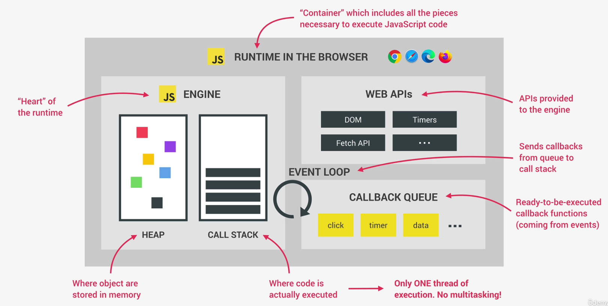

# JavaScript Run Time in the Browser

So, a JavaScript runtime is basically a container which includes all the different pieces that are necessary to execute JavaScript code.

The heart of every JavaScript runtime is the engine.This is where code is actually executed and where objects are stored in memory. These two things happen in the call stack and in the heap.

It's important to note here that JavaScript has only one thread of execution, so it can only do one thing at a time. There is absolutely no multitasking happening in JavaScript itself. Other languages like Java can execute multiple pieces of code at the same time, but not JavaScript.

We also have the web APIs environment. These are some APIs provided to the engine, but which are actually not part of the JavaScript language itself. Things like the DOM timers the fetch API, the geolocation API, and so on and so forth.

There is the callback queue as well. This is a data structure that holds all the ready to be executed callback functions that are attached to some event that has occurred.

Finally, whenever the call stack is empty the event loop takes callbacks from the callback queue and puts them into call stack so that they can be executed.
So the event loop is the essential piece that makes asynchronous behavior possible in JavaScript.

It's the reason why we can have a non blocking concurrency model in JavaScript. A concurrency model is simply how a language handles multiple things happening at the same time.
