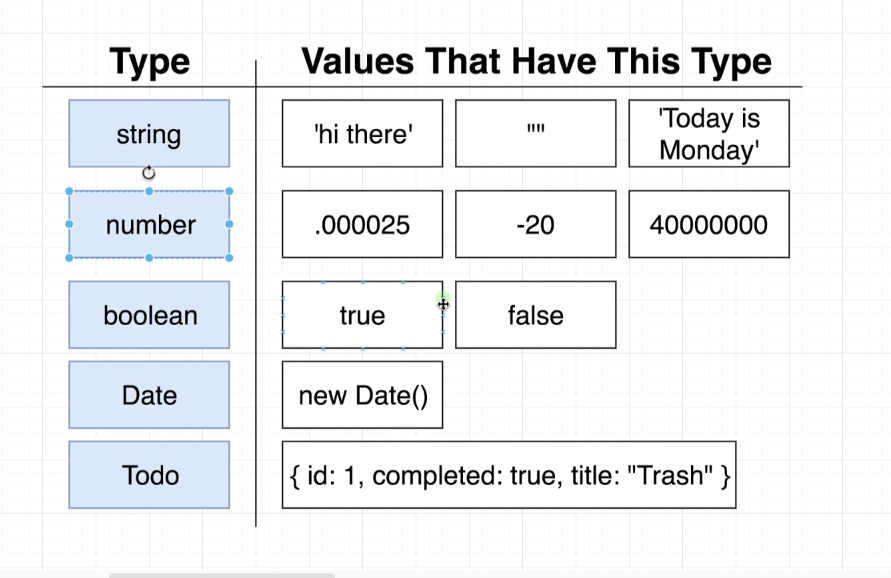
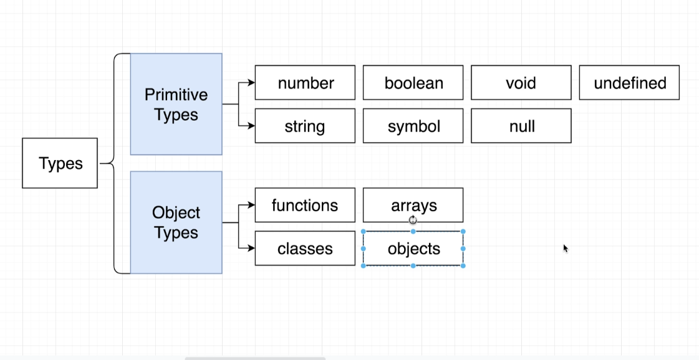
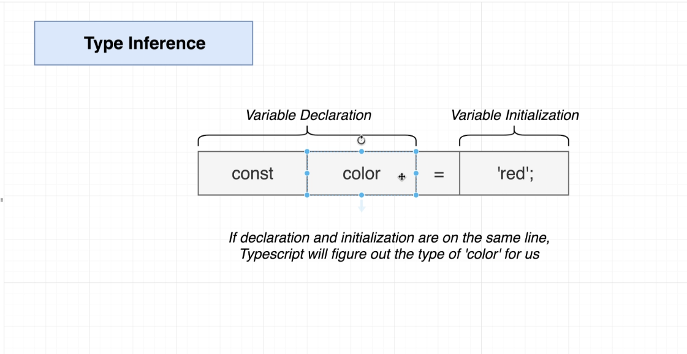
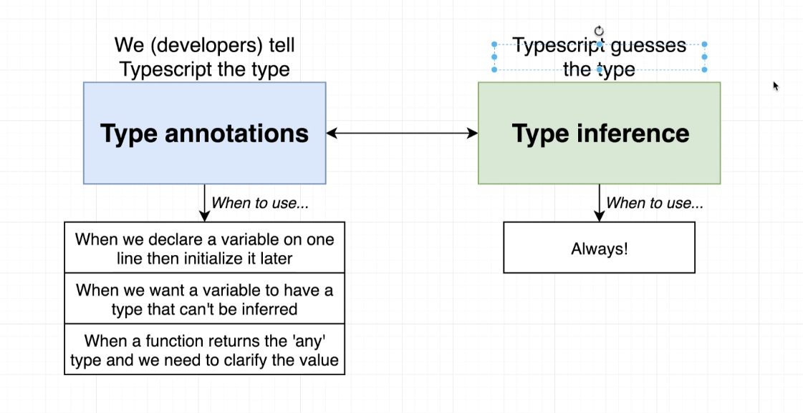
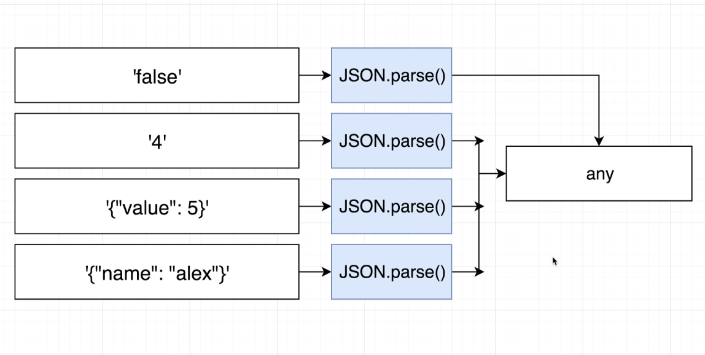
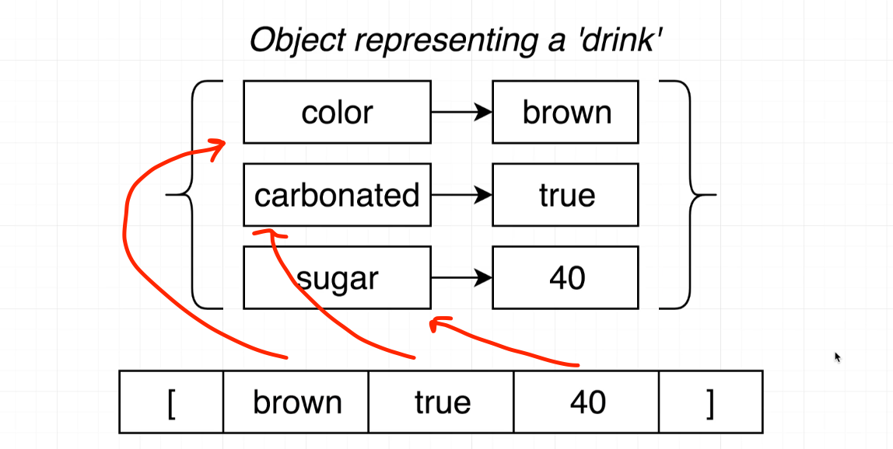
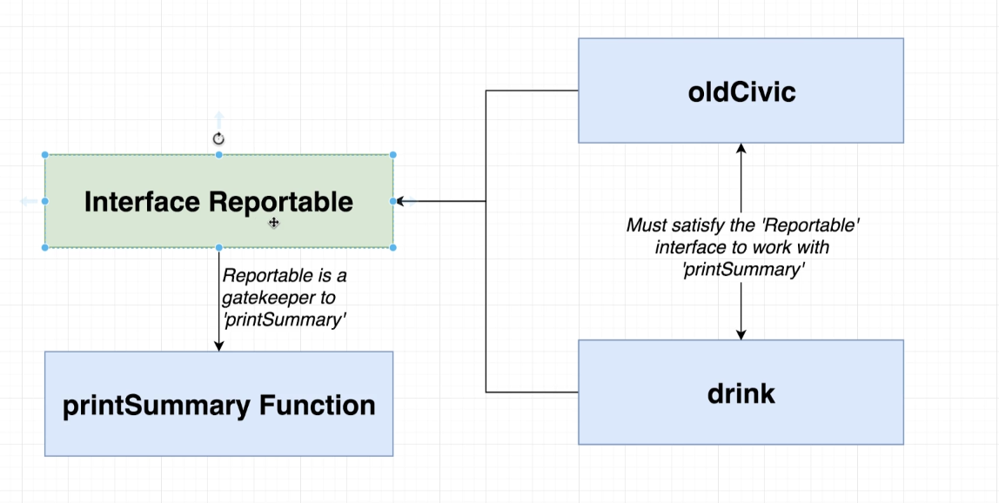
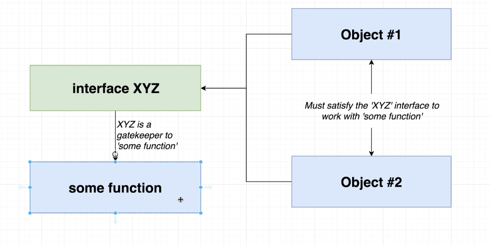

# Typescript: the complete Developer's Guide

### Resources

[TS Converter](https://www.typescriptlang.org/)
[Course S. Grider's Finished Code](https://github.com/StephenGrider/typescriptcasts)

Using jsonplaceholder.typecode.com API

https://jsonplaceholder.typicode.com/todos/1

## Help

`$ tsc --help`

## Install

`$ npm install -g typescript ts-node`

If typescript is already install, install 'ts-node'

`$ npm install -g ts-node`

## Create project

`$ mkdir fetchjson && cd fetchjson`
`$ npm init -y`

### Install Axios

`$ npm install axios`

### Create Index.ts and Run Compiler

`$ touch index.ts`

```js
import axios from 'axios';

const url = 'https://jsonplaceholder.typicode.com/todos/1';

axios.get(url).then((response) => {
  console.log(response.data);
});
```

`$ tsc index.ts`

Typescript creates a 'index.js' version of our file.

Running `$ node index.js` prints `{ userId: 1, id: 1, title: 'delectus aut autem', completed: false }` to the terminal.

Running `$ ts-node index.ts` prints the same.

## Section 2

Definitions:

### Types

'Easy way to refer to the different properties + functions that a value has'

Types are used by the Typescript Compiler to analyze our code for errors.
Types allow other engineers to understand what values are flowing around our codebase

Value: Anything we can assign to a variable. For example strings, numbers, booleans, null, undefined, objects, functions, classes, arrays, etc. Any of these have a type. A class have a type, a number has a type, etc

For example: 'red' is a string. Which is a value that has all the properties + methods that we assume a string has.
In this case this case it means it includes properties and methods a 'string' has in JavaScript:

- charAt()
- charCodeAt()
- concat()
- includes()
- endWith()
- indexOf()
- lastIndexOf()
- localeCompare()
- match()
- etc

Types are shortcuts and labels for describing the different properties and methods a single value has. Every value in typescript has a type.



#### Different Kinds of Types

##### Primitive Types

- number
- boolean
- void
- undefined
- string
- symbol
- null

##### Object Types

- functions
- arrays
- classes
- objects



With object types we can write some code to 'trick' TypeScript to think the value it is a certain type. We can only do this with object types but not with primitive types.

## Type Annotations and type Inference

### Type Annotations

Code we add to tell Typescript what type of value a variable will refer to
The developer tell TypeScript the type

### Type Inference

Typescript tries to figure out what type of value a variable refers to
TypeScript guesses the type
If we do the initialization in the same line TS can figure out the type for us
However, if the initialization happens in another line we would get type 'any'

```javascript
let apples; // type any
apples = 5;
```



#### When To Use Each

#### Type Annotation

- When we declare a variable on one line then initialize it later
- When we want a variable to have a type that can't be inferred
- When a function returns the 'any' type and we need to clarify the value

##### Type Inference

- Always



## The Any Type

When TS doesn't know what type to expect assigns the 'any' type.

The 'any' type is a regular type just like 'string' or 'boolean' are. It means TS has no idea what this is - can't check for correct property references.

<!-- prettier-ignore -->
**AVOID VARIABLES WITH 'ANY' AT ALL COST**



## Type For Functions

### Type Annotations for Functions

Code we add to tell TS what type of arguments a function will receive and what type of values it will return.

### Type Inference for Functions

TS tries to figure out what type of value a function will return but not what type of value the arguments are.

Typescript makes sure we are returning the correct type of value but it doesn't check the logic in the function.

```javascript
const add = (a: number, b: number): number => {
  return a - b; // TS won't catch the logic and notice that we have a '-' instead of a '+'
};
```

Always annotate the arguments type in a function. **No type inference for arguments**
TS inference will sort out the return type, however, it's not advisable to use it. Annotate the type for the return too.

## Type for Arrays

Arrays where each element is some consistent type of value.

- TS cand type inference when extracting values from an array
- TS can prevent us from adding incompatible values to the array
- We can get help with 'map', 'forEach', 'reduce' functions
- Flexible - arrays can still contain multiple different types.

### Where To Use Typed Arrays?

Any time we need to represent a collection of records with some arbitrary sort order.

## Type for Tuples

Tuple: Array-like structure where each element represents some property of a record.



Tuples are useful when working with CSV files for example.
In general other form of collections are preferred over Tuples. Out of context a tuple can be very criptic and hard for the developer to tell what each element is

Example:

```javascript
// tuple example. It's hard to know what each element is when seen out of context.
const carSpecs: [number, number] = [400, 3354];

// easy to see what it's going on at a glance. Better option to model a record this way.
const carStats = {
  horsePower: 400,
  weight: 3354,
};
```

<hr/>

## Interfaces

Creates a new type, describing the property names and value types of an object.
When we create an interface, we are creating a new type inside our application just the same way we have types like string or boolean or number. We are creating a new type that is a custom type that we define.

Interfaces' names start with a capital letter and must be generic to describe the properties it has. i.e. Vehicle.
When we create an interface we create a custom type we can reuse. In the exampel Vehicle is a variable of sort that refers to a type.

```javascript
interface Vehicle {
  name: string;
  year: number;
  broken: boolean;
}

const printVehicle = (vehicle: Vehicle) {
  console.log(vehicle.name);
}
```

Typescript uses this type to check the object we pass it on. If one of the properties is missing or mispelled, TS will throw an error pointing it out.
Inside an interface we are not limited to just primitive value, we can for example assign a property and instance of Date or a function.

```javascript
interface Vehicle {
  name: string;
  year: Date;
  broken: boolean;
  summary(): string;
}

const oldCivic = {
  name: 'civic',
  year: new Date(),
  broken: true,
  summary(): string {
    return `Name: ${this.name}`;
  },
};

const printVehicle = (vehicle: Vehicle): void => {
  console.log(vehicle.summary());
};

printVehicle(oldCivic);
```

### Reusability

If we create another object that has different properties but also has a 'summary' property we can use our interface as type for it. In this example both 'drink' and 'vehicle' are considered of type 'Reportable'.

```javascript
const drink = {
  color: 'brown',
  carbonated: true,
  sugar: 40,
  summary(): string {
    return `My drink has ${this.sugar} grams of sugar`;
  },
};

const printSummary = (item: Reportable): void => {
  console.log(item.summary());
};

printSummary(oldCivic);
printSummary(drink);
```



#### General Strategy for Reusable Code in TS

- Create functions that accept arguments that are typed with interfaces
- Objects/classes can decide to 'implement' a given interface to work with a function.


