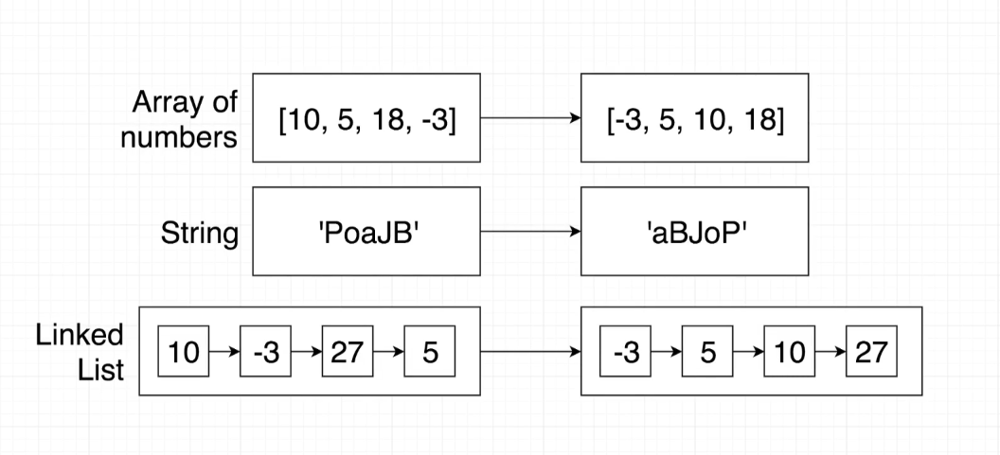

# Sort Project

## Lessons 75 to 93



### Configure TS Compiler

Create a sort directory and move into it.

`$ mkdir sort && cd sort`

Create directories 'src' and 'build'.

`$ mkdir src build`

Create file 'index.ts' with some code into directory 'src'.

```
$ cat > src/index.ts <press Return>
console.log('hi there')
<press Ctrl + D>
```

Configure TS Compiler

`$ tsc --init`

Inside 'tsconfig.json' change the following two variables:

```
"outDir": "./build"
"rootDir": "./src"
```

Then run to compile.

`$ tsc -w` // the flag '-w' will watch for changes.

### Generate Package.json file

Generate package.json file

`$ npm init -y`

in the terminal you'll see:

```
{
  "name": "sort",
  "version": "1.0.0",
  "description": "",
  "main": "index.js",
  "scripts": {
    "test": "echo \"Error: no test specified\" && exit 1"
  },
  "keywords": [],
  "author": "",
  "license": "ISC"
}
```

`$ npm install nodemon concurrently`

nodemon: re runs node everytime a file changes inside our project.
concurrently: helps us run multiple scripts at the same time.

#### Add The New Scripts

```
{
  "name": "sort",
  "version": "1.0.0",
  "description": "",
  "main": "index.js",
  "scripts": {
    "start:build": "tsc -w",
    "start:run": "nodemon build/index.js",
    "start": "concurrently npm:start:*"
  },
  "keywords": [],
  "author": "",
  "license": "ISC",
  "dependencies": {
    "concurrently": "^6.2.1",
    "nodemon": "^2.0.12"
  }
}
```

To compile and watch run
`$ npm start`

## Implementation of the Sort app

### Bubble Sort logic

The algorithm checks each item in pairs, from left to right.

For example, given [0, 5, -1, 10] the algorithm will compare 0 to 5. 0 is lower than 5 so no change takes place.
Next 5 is compared to -1. -1 is lower than 5 so it moves to its left. Then 5 is compared to 10, and we have no changes.Now we have [0, -1, 5, 10]. At this point we are guaranteed that the last number to the right it's the greates of the collection.
The process starts over, excluding the last element. This process continuos until all elements are excluded and the final result is that the elements are sorted in ascending order left to right.

## Type Guards

#### typeof

When we use a type guard for primitive types, we use the 'typeof' operator. Narrow type of a value to a primitive type.
(number, string, boolean, symbol)

```javascript
if (typeof this.collection === 'string') {
  // logic goes here
}
```

#### instanceof

Use instanceof on every other value that is created with a constructor function. Narrow down every other type of value.

```javascript
if (this.collection instanceof Array) {
  // logic goes here
}
```

## Abstract Class

- Can't be used to create an object directly
- Only used as a parent class
- Can contain real implementation for some methods
- The implemented methods can refer to other methods that don't actually exist yet (we still have to provide names and types for the un-implemented methods)
- Can make child classes promise to implement some other method.

### Interfaces Vs Inheritance/Abstract Classes

#### Interfaces

- Sets up a contract between different classes.
- Use when we have very different objects that we want to work together.
- Promotes loose coupling.

#### Inheritance/ Abstract Classes

- Sets up a contract between different classes.
- Use when we are trying to build up a definition of an object.
- Strongly couples classes together.
